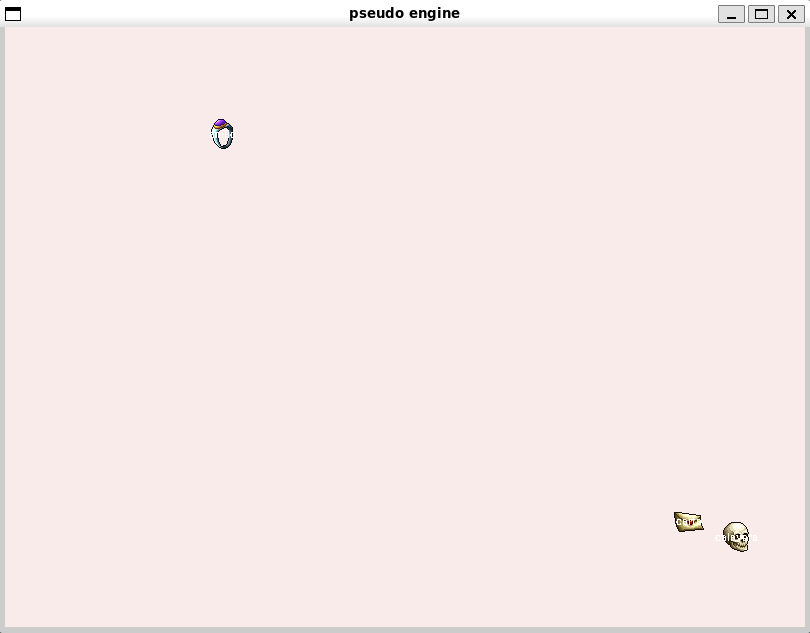
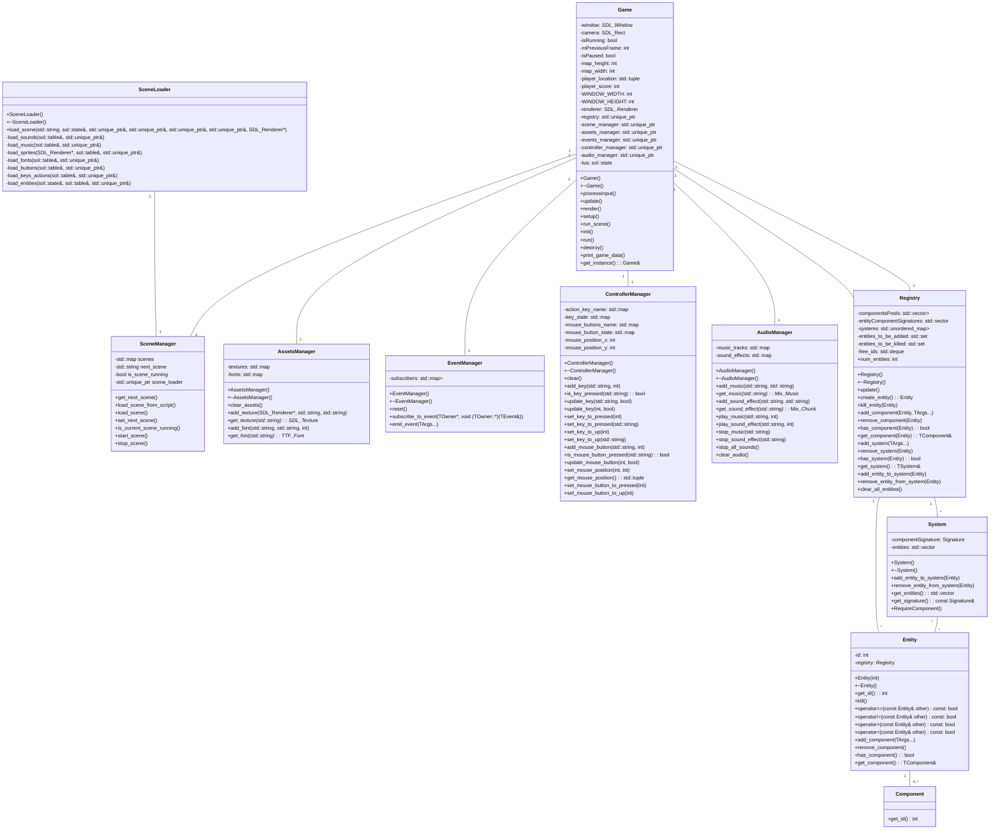

# Creación de Videojuegos ─ Tarea 1: Introducción a SDL2 y los motores de videojuegos
## Entrega
Fecha de entrega: 27 de octubre de 2024


## Descripción del juego
Es un juego de ciencia ficción en el que el jugador controla una nave espacial que debe esquivar asteroides y naves enemigas, mientras dispara a enemigos.
El juego cuenta con :
- un menú principal
- una pantalla de introducción para tener mas contexto sobre la historia
- tres niveles
- una pantalla de "muerte" donde llega el jugador si se muere que permite redirrecionar a los tres niveles
- una pantalla de "congratulation" que permite redirrecionar al menu principal
El juego cuenta con música de fondo y assets propios. 

## Controles
- W: Mover la nave hacia arriba
- S: Mover la nave hacia abajo
- A: Mover la nave hacia la izquierda
- D: Mover la nave hacia la derecha
- Espacio: Disparar
- P: Pausar el juego

## Historia del juego
El juego se desarrolla en un futuro muy lejano donde la humanidad ha colonizado otros sistemas solares y otras galaxias, tras milenios la humanidad se ha ido olvidando de su origen y de la tierra o "Terra" como se refiere en el juego.
Al pasar tanto tiempo los humanos olvidaron de donde venian, muchos creen que siempre han vivido en el espacio, pero hay una leyenda que habla de un pequeño planeta perdido en la inmensidad del espacio, un planeta que fue el origen de la humanidad, un planeta que se llama "Terra".
El/la jugador/a interpreta al Capitan Castellum, al encontrar un antiguo artefacto en una de las colonias, el capitan descubre que el artefacto es una especie de mapa que lo lleva a un portal que lo llevara a "Terra", el capitan decide seguir el mapa y descubrir la verdad sobre el origen de la humanidad.
Tras recolectar los artefactos necesarios, el capitan llega a "Terra", el juego termina con una pantalla de "congratulation", dejando al jugador con la duda de que descubrio el capitan en "Terra".

## Objetivos del juego
Para ir avanzando en el juego, el jugador debe:
- recolectar power ups que le permiten moverse mas rapido, a nivel de narrativa, estos items representan antiguas tecnologias que permite a la nave pasar a traves de los portales para llegar al siguiente nivel
- disparar a los enemigos para ganar tener el mayor score posible
- esquivar los asteroides y naves enemigas para no morir
- el jugador no puede pasar al siguiente nivel si no ha recolectado todos los artefactos necesarios

## 4 enemigos
En mi juego hay 4 enemigos:
- asteroides, no se pueden destruir, pero si se pueden esquivar
- enemigos arrañas, se pueden destruir con un disparo y dan 10 puntos, usualmente no se mueve muy rapido
- enemigos circulares azules, se pueden destruir con un disparo y dan 15 puntos, usualmente se mueve mas rapido que los enemigos arrañas y "rodan"
- enemigos circulares rojos, son muy grandes y no se pueden destruir


## Guía de uso
Para compilar el programa, ejecute el siguiente comando:
```bash
make; make run
```
El proyecto fue desarrollado en Ubuntu 24.04 en WSL2, utilizando el compilador g++ 13.2.0

El makefile para funcionar con mi arquitectura de carpeta fue modificado.

### Archivo de configuración
El archivo de configuración config.txt sigue el mismo formate que el archivo dado por el profesor.

## Proceso de desarrollo
Para desarrollar el pseudo motor de videojuegos, se crearon se usaron los siguientes archivos:
- main.cpp, crea un juego y lo ejecuta
- game.hpp y game.cpp, implementan la clase Game donde tenemos las funciones de inicialización, leer eventos, actualización y renderizado, esa clase ademas de eso tiene una multitud de atributos para almacenar las entidades y las configuraciones de la ventana y fuente.
- entity.hpp y entity.cpp, implementan la clase Entity que representa una entidad con un id unico, similar a la clase "persona" visto en los videos de clase, esos archivos no se usaron en el programa final, pero probablemente se usen en futuras implementaciones.
- configuration.hpp y configuration.cpp, implementan los structs que contienen los datos de configuración de la ventana, fuente y entidades, además de un struct color que se usa para almacenar colores en formato RGB, el cual en futuras implementaciones se podra cambiar por SDL_Color. Ademas de esos structs se implementa la función de lectura de configuración que lee el archivo config.txt usado para configurar el juego.

El desarrollo del motor se llevo a cabo siguiendo los videos disponibles en la plataforma, y agregando poco a poco las funcionalidades requeridas por la tarea, como la lectura de configuración, personalización de la clase Game para que tenga un vector de entity y los structs mencionados anteriormente, la funcionalidad de tener tantos entidades como se requiere en el archivo de config, y otras funcionalidades como pausar el juego usando la tecla "p" o que las imagenes reboten en los angulos de la ventana.

Adjunto se agrego un screenshot del programa ejecutandose:



## Instalación de las bibliotecas necesarias
Para instalar las bibliotecas necesarias en linux, ejecute el siguiente comando:
```bash
sudo apt install libsdl2-dev libsdl2-image-dev libsdl2-ttf-dev libsdl2-mixer-dev lua5.3 liblua5.3-dev
```

## Puntos extras
Para obtener puntos extras, implemente las siguientes características:
- [x] Se implemento el audio manager para reproducir música de fondo y efectos de sonido, ademas se usaron audios hechos propios por [Namlin] (https://github.com/namlin)
- [x] Todos los assets graficos, salvo las fuentes y el background fueron hechos por mi usando el programa [GIMP](https://www.gimp.org/)

## UML del motor de videojuegos


## Ressources used for the game
- [arcade classic font](https://www.1001fonts.com/arcadeclassic-font.html)
- [background generator](https://deep-fold.itch.io/space-background-generator)
- Music made by game developer [Namlin] (https://github.com/namlin)


## TODO
- [ ] Implement new scene introducing the characters after intro scene in some sort of "cinematic"